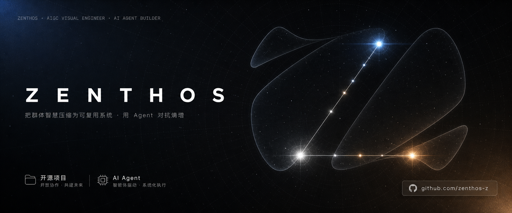

  

<h1 align="center">Hi, I'm Zenthos 👋</h1>

  <b>AIGC · AI Agent 开发者 · 室内设计师</b> 
  <i>把群体智慧压缩为可复用系统，用 Agent 对抗熵增。</i>

  
  
  
  
  

---

## 🚀 Featured Projects

> 三个方向：AI 健身应用 · 群聊知识压缩 · 生图 Agent 自迭代

| Project | What it does | Stack |
|---------|-------------|-------|
| [**star-fit**](https://github.com/zenthos-z/star-fit) | 🏋️ AI 时代的健身搭子 — 本地优先的健身记录与 AI 教练（Deep Agents + SSE 流式 + uiHint 多态卡片） | TypeScript · React · Fastify · Capacitor |
| [**z-winnow**](https://github.com/zenthos-z/z-winnow) | 🧹 winnow — 把群聊噪声压缩为结构化知识：LangGraph 降噪管道 + L3 知识层 + MCP 接口 + 长期群记忆 | Python · LangGraph · FastMCP · FastAPI |
| [**img-iter-agent**](https://github.com/zenthos-z/img-iter-agent) | 🎨 benchmark 驱动的 AI 生图 Agent 自迭代系统：Generator × Critic 对抗闭环自动收敛最优 prompt 策略，人工排序校准，双层经验蒸馏 | Python · LangGraph · LLM Eval |

## 🛠️ Claude Code Skills — [my-skills](https://github.com/zenthos-z/my-skills)

> 为 Claude 注入领域专属能力的技能包，`npx skills add zenthos-z/my-skills/<技能名>` 即装即用

| Skill | What it does | Runtime |
|-------|-------------|---------|
| [**mermaid-pro**](https://github.com/zenthos-z/my-skills/tree/main/mermaid-pro) | 专业 Mermaid 图表：内置语法校验、9 色语义配色、7 种图型、批量导出 SVG/PNG | Node.js（离线） |
| [**systems-thinking**](https://github.com/zenthos-z/my-skills/tree/main/systems-thinking) | 基于《系统思考》方法论的教练：5 阶段访谈、反馈回路识别、杠杆点发现、会话持久化 | 零依赖 |
| [**qunribao**](https://github.com/zenthos-z/my-skills/tree/main/qunribao) | 微信群日报/周报自动生成：议题追踪、图片描述、飞书多维表格上传、隐私扫描 | Python + WeFlow |
| [**quick-img**](https://github.com/zenthos-z/my-skills/tree/main/quick-img) | 快速生图：模板/精炼/批量抽卡三模式、14 种宽高比、思源笔记集成 | Python + DMX API |

## 💡 What I'm Focused On

- 🤖 构建 **AI Agent 系统**：从多 Agent 对抗协作、反馈闭环到经验蒸馏
- 🧹 探索 **群体智慧压缩**：把高噪声的群聊/信息流转化为结构化知识资产
- 🎨 深耕 **AIGC 工程化**：prompt 策略自动收敛、视觉生成质量评估与校准
- 📖 研究 **世界模型 / 强化学习**：智能体如何基于模型预测未来

---

  <i>Feel free to explore my repos and try the projects!</i>

